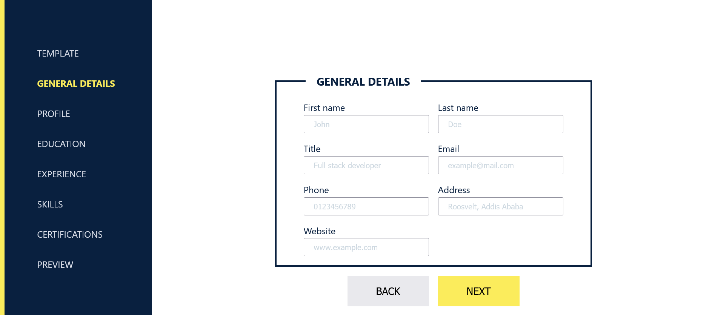

# Simple resume template maker

This project was bootstrapped with [Create React App](https://github.com/facebook/create-react-app).

## Available Scripts

In the project directory, you can run:

### `yarn start`

Runs the app in the development mode.\
Open [http://localhost:3000](http://localhost:3000) to view it in your browser.

The page will reload when you make changes.\
You may also see any lint errors in the console.

### Allows add, edit and deleted
### Three templates to choose form
### Add general details
### Add experience
### Add profile summary
### Add skills
### Add certifications
### Preview outcome
### Download template

[Live App here](https://a-adeleye.github.io/cv-maker/).